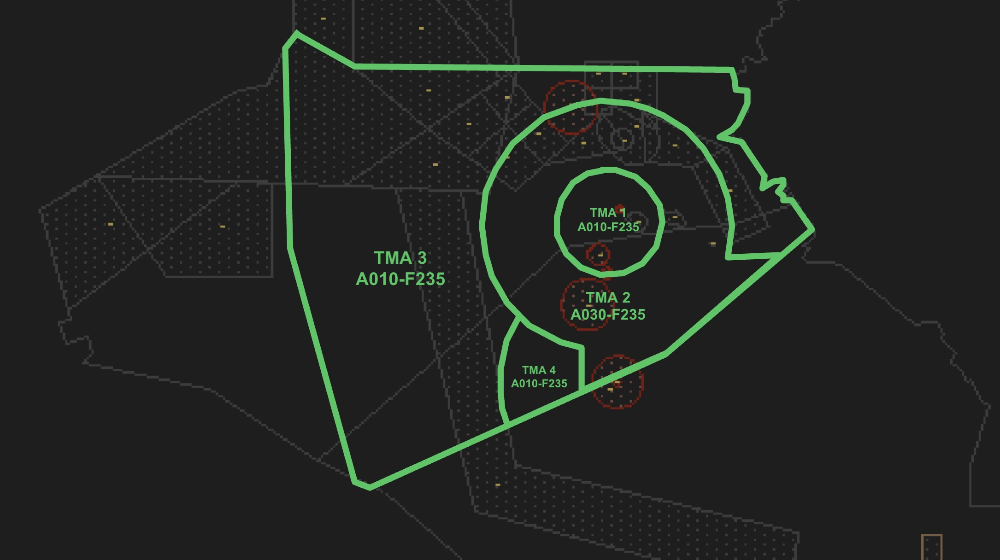
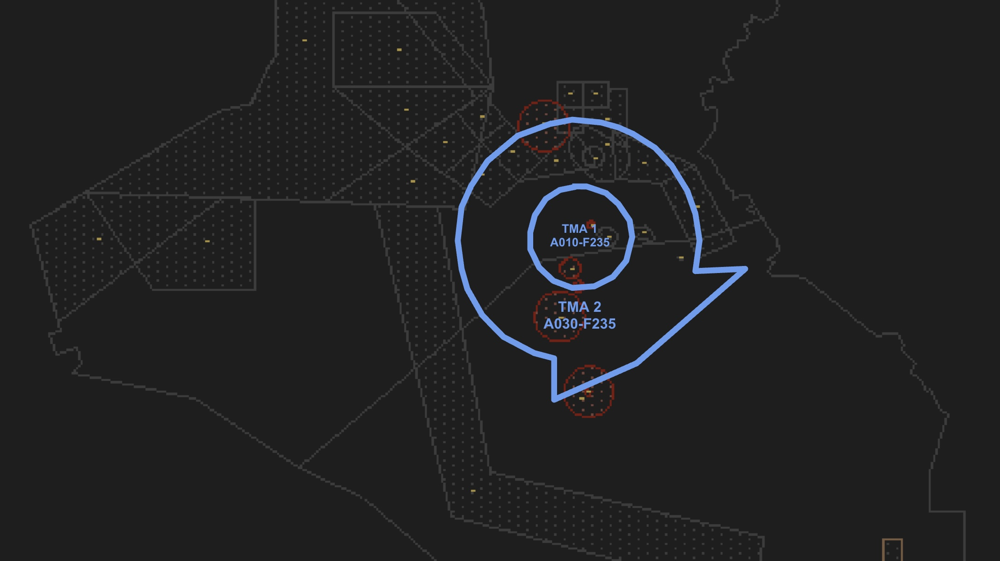

--8<-- "includes/abbreviations.md"

## Positions

| Name | Callsign | Frequency | Login ID | Remarks |
| ---- | -------- | ---------	| -------- | ------- |
| **Baghdad APP**	| **Baghdad Approach** | **122.400**	| **ORBI_APP**	| |
| **Baghdad DEP**	| **Baghdad Approach** | **128.200** | **ORBI_DEP**	| |

## Airspace - Class D
**ORBI_APP** is responsible for the entire Baghdad TMA airspace from `A010` and `A030` to `F235`.

**ORBI_DEP** is responsible for Baghdad TMA's 1 and 2 airspace from `A010` and `A030` to `F235`.

